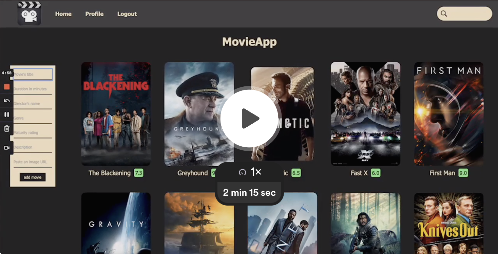

# MovieApp :video_camera:

MovieApp is a versatile and fully-featured Spring Boot application with a user-friendly interface, enabling you to seamlessly manage your movie interests, discover new favorites and keep track of reviews and ratings.

## Project Demo

## Features

1. Displaying the movie library and average ratings.
2. Adding new movies to the shared movie library.
3. Accessing specific movie details.
4. Search Functionality: Allows users to locate a specific movie by its complete or partial title.
5. Feedbacks: Users can rate a movie and leave a comment.
6. Singed-in users can edit and/or delete their feedbacks.
7. Authentication process: Users can register/login.

## Technologies Used

### Frontend
* HTML
* CSS
* JavaScript

### Backend
* Java
* Spring Boot 
  * Spring Data JPA
  * Spring Data REST
  * Spring Web
  * PostgreSQL
  * Project Lombok
  * Spring Security Core
  * Spring Boot Maven Plugin